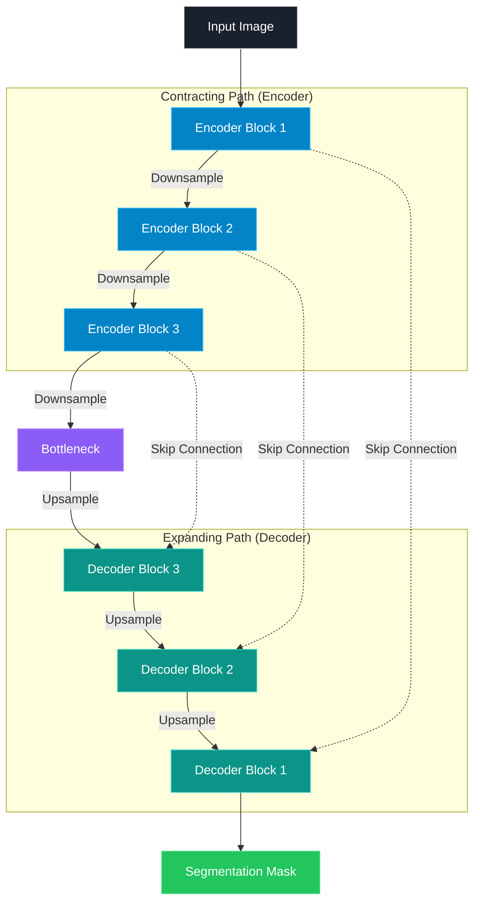

# Robust Object Detection and Tracking under Challenging Conditions

## Overview

This project develops a **robust computer vision pipeline for object detection and multi-object tracking in challenging aerial environments**.

The system combines **YOLO26n** for object detection with **ByteTrack** for tracking objects across video frames.

The project focuses on the challenges commonly encountered in aerial imagery, including:

* Small objects
* Dense scenes
* Occlusion
* Multiple object categories
* Complex backgrounds
* Large variations in object scale

The complete pipeline covers **data preparation, model training, evaluation, error analysis, and multi-object tracking**.

---

## Pipeline

---

## Dataset

### VisDrone

The **VisDrone dataset** was used for training and evaluating the object detection model.

The dataset contains 10 object categories:

| ID | Class           |
| -: | --------------- |
|  0 | Pedestrian      |
|  1 | People          |
|  2 | Bicycle         |
|  3 | Car             |
|  4 | Van             |
|  5 | Truck           |
|  6 | Tricycle        |
|  7 | Awning-tricycle |
|  8 | Bus             |
|  9 | Motor           |

### Dataset Statistics

| Split      | Images |
| ---------- | -----: |
| Training   |  6,471 |
| Validation |    548 |

The validation set contains approximately **38,759 annotated object instances**.

---

## Model

### YOLO26n

A lightweight **YOLO26n** architecture was used as the object detector.

| Configuration    | Value           |
| ---------------- | --------------- |
| Model            | YOLO26n         |
| Input resolution | 640 × 640       |
| Batch size       | 8               |
| Training device  | NVIDIA Tesla T4 |
| Parameters       | ~2.5M           |
| GFLOPs           | ~5.9            |

The lightweight model was selected to study the trade-off between **detection performance and computational efficiency**.

---

## Training Experiments

Two training experiments were conducted.

### Baseline — 10 Epochs

| Metric    | Score |
| --------- | ----: |
| Precision | 0.345 |
| Recall    | 0.256 |
| mAP50     | 0.229 |
| mAP50-95  | 0.123 |

### Extended Training — 30 Epochs

The best model obtained from the baseline experiment was further trained for 30 epochs.

| Metric    |     Score |
| --------- | --------: |
| Precision | **0.411** |
| Recall    | **0.313** |
| mAP50     | **0.292** |
| mAP50-95  | **0.160** |

### Performance Comparison

| Metric    | 10 Epochs | 30 Epochs | Improvement |
| --------- | --------: | --------: | ----------: |
| Precision |     0.345 |     0.411 |      +0.066 |
| Recall    |     0.256 |     0.313 |      +0.057 |
| mAP50     |     0.229 |     0.292 |      +0.063 |
| mAP50-95  |     0.123 |     0.160 |      +0.037 |

The extended training configuration improved **precision, recall, mAP50, and mAP50-95**.

---

## Per-Class Performance

Final model performance using **mAP50**:

| Class           |     mAP50 |
| --------------- | --------: |
| Pedestrian      |     0.319 |
| People          |     0.232 |
| Bicycle         |     0.061 |
| Car             | **0.708** |
| Van             |     0.334 |
| Truck           |     0.267 |
| Tricycle        |     0.191 |
| Awning-tricycle |     0.109 |
| Bus             |     0.374 |
| Motor           |     0.325 |

The model performs particularly well on **car detection**, while smaller and less frequent categories such as bicycles and awning-tricycles remain more challenging.

---

## Error Analysis

A dedicated error analysis was performed on the validation set.

The analysis investigates common failure cases such as:

* False positives
* Missed detections
* Small objects
* Occluded objects
* Dense object regions
* Difficult object categories

This analysis helps identify the limitations of the detector beyond global evaluation metrics.

---

## Multi-Object Tracking

The trained YOLO26n detector was integrated with **ByteTrack** to perform multi-object tracking.

```text
Video
  ↓
YOLO26n
  ↓
Object Detection
  ↓
Bounding Boxes
  ↓
ByteTrack
  ↓
Object IDs
  ↓
Tracked Objects
```

ByteTrack associates detections across consecutive frames, allowing the system to maintain object identities throughout a video sequence.

---

## Detection Results

The final model achieved:

| Metric    |        Result |
| --------- | ------------: |
| Precision |     **0.411** |
| Recall    |     **0.313** |
| mAP50     |     **0.292** |
| mAP50-95  |     **0.160** |
| Inference | ~2.5 ms/image |

The results show that additional training improved the overall detection performance while maintaining a lightweight model architecture.

---

## Technologies

### Programming Language

* **Python**

### Deep Learning

* **PyTorch**
* **Ultralytics**
* **YOLO26n**

### Computer Vision

* **OpenCV**
* Object Detection
* Multi-Object Tracking
* Video Processing
* Bounding Box Analysis

### Tracking

* **ByteTrack**

### Data & Evaluation

* **NumPy**
* **Pandas**
* **Scikit-learn**
* **Matplotlib**
* Precision
* Recall
* mAP50
* mAP50-95
* Per-class evaluation
* Error analysis

### Dataset

* **VisDrone**

### Hardware

* **NVIDIA Tesla T4 GPU**

---

## Key Skills Demonstrated

This project demonstrates practical experience with:

* Deep Learning
* Computer Vision
* Object Detection
* YOLO architectures
* Multi-Object Tracking
* Model Training
* Transfer of detections to tracking
* Model Evaluation
* Error Analysis
* Video-based inference
* GPU-based experimentation
* Performance analysis
* Real-world aerial imagery

---

## Project Structure

```text
robust-object-detection-tracking-visdrone/
│
├── README.md
├── LICENSE
├── .gitignore
├── requirements.txt
│
├── notebook/
│   └── visdrone_detection_tracking.ipynb
│
└── results/
    ├── detection_results.png
    ├── error_analysis.png
    └── tracking_demo.mp4
```

---

## Future Work

Possible extensions include:

* Improving small-object detection
* Aerial-image-specific data augmentation
* Hyperparameter optimization
* Higher-resolution training
* Comparison with larger YOLO architectures
* More advanced tracking algorithms
* Real-time deployment optimization
* Evaluation on additional aerial datasets

---

## Author

**Meriem Tafraoui**

AI Engineering Student
Université Mustapha Stambouli, Mascara, Algeria
